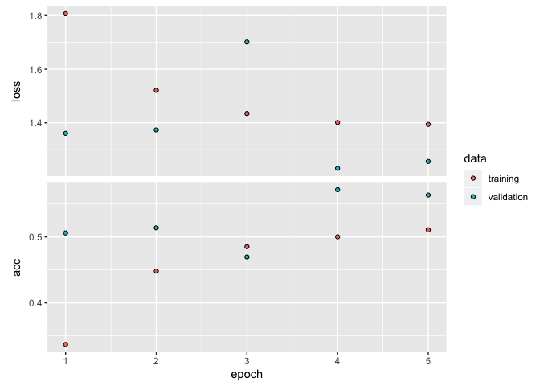

R Dilinde Keras Kullanımı
=========================

Herkese merhaba, bu çalışmada/yazımda olabildiğince basit bir şekilde R
dilinde keras ile cnn modeli oluşturmaya çalışacağız. Hadi başlayalım.
[Kaynak](https://keras.rstudio.com/)

**Not:** Bu yazı derin öğrenmeyi anlatan bir yazı değildir. Keras
kütüphanesini R dilinde nasıl kullanılacağına dağir bir giriş yazısıdır.

R studio’da keras yüklenmesi
============================

Önce r studio’nun packages kısmandan keras kütüphanesini yüklüyoruz.
Daha sonra aşağıdaki kodu çalıştırıyoruz.

    library(keras)
    #devtools::install_github("rstudio/keras") # Bir sorun olursa bu kodu kullanarak yüklemeyi deneye bilirsiniz.
    #install_keras()
    library(zeallot) # Çoklu değişken atama için.

    is_model = F

Veri Setinin Tanıtımı ve Yüklenmesi
===================================

Bu çalışmada cifar-10 veri setini kullanacağız.

CIFAR-10: CIFAR-10, nesne tanıma için kullanılan yerleşik bir
bilgisayar-görü veri setidir. 80 milyon minik resim veri setinin bir alt
kümesidir ve sınıf başına 6000 resim içeren, 10 nesne sınıfından birini
içeren 60.000 32x32 renkli resimden oluşur. Alex Krizhevsky, Vinod Nair
ve Geoffrey Hinton tarafından toplandı.

Daha ayrıntılı bilgi için [Kaggle’da bu adrese
bakabilirsiniz](https://www.kaggle.com/c/cifar-10)

    data <- dataset_cifar10()
    c(c(x_train,y_train),c(x_test,y_test)) %<-% data

    str(data)

    ## List of 2
    ##  $ train:List of 2
    ##   ..$ x: int [1:50000, 1:32, 1:32, 1:3] 59 154 255 28 170 159 164 28 134 125 ...
    ##   ..$ y: int [1:50000, 1] 6 9 9 4 1 1 2 7 8 3 ...
    ##  $ test :List of 2
    ##   ..$ x: int [1:10000, 1:32, 1:32, 1:3] 158 235 158 155 65 179 160 83 23 217 ...
    ##   ..$ y: num [1:10000, 1] 3 8 8 0 6 6 1 6 3 1 ...

    summary(data)

    ##       Length Class  Mode
    ## train 2      -none- list
    ## test  2      -none- list

Veri Ön İşleme
==============

Resimleri işlemeye uygun hale getirelim.

    x_train <- x_train / 255 # Gray scale için
    x_test <- x_test / 255  # Gray scale için
    y_train <- to_categorical(y_train, num_classes = 10) # Kategorik değişkene çevirme işlemi
    y_test <- to_categorical(y_test, num_classes = 10) # Kategorik değişkene çevirme işlemi

Model
=====

Resimleri siyah beyaz yaptıktan ve kategorilerimizi keras’ın analayaca
şekle soktuktan sonra, cnn modelle ilgili işlemlere geçebiliriz.

Modelin Tanımlanması
--------------------

Öncelikle model mimarisini oluşturalım.

    model <- keras_model_sequential()

    model %>%
     
      layer_conv_2d(
        filter = 32,
        kernel_size = c(3,3),
        padding = "same", 
        input_shape = c(32, 32, 3),
        activation = "relu"
      ) %>%
     
      layer_conv_2d(filter = 32,
                    kernel_size = c(3,3),
                    activation = "relu") %>%
        
      layer_max_pooling_2d(pool_size = c(2,2)) %>%
      layer_dropout(0.25) %>%
      
      layer_conv_2d(filter = 32,
                    kernel_size = c(3,3),
                    padding = "same",
                    activation = "relu") %>%

      layer_conv_2d(filter = 32,
                    kernel_size = c(3,3),
                    activation = "relu") %>%
        
      layer_max_pooling_2d(pool_size = c(2,2)) %>%
      layer_dropout(0.25) %>%
      
      layer_flatten() %>%
      layer_dense(512, activation = "relu") %>%
      layer_dropout(0.5) %>%

      layer_dense(10, activation = "softmax")

Oluşturduğumuz modelin nasıl gözüktüğüne bir bakalım.

    str(model)

    ## Model
    ## Model: "sequential"
    ## ___________________________________________________________________________
    ## Layer (type)                     Output Shape                  Param #     
    ## ===========================================================================
    ## conv2d (Conv2D)                  (None, 32, 32, 32)            896         
    ## ___________________________________________________________________________
    ## conv2d_1 (Conv2D)                (None, 30, 30, 32)            9248        
    ## ___________________________________________________________________________
    ## max_pooling2d (MaxPooling2D)     (None, 15, 15, 32)            0           
    ## ___________________________________________________________________________
    ## dropout (Dropout)                (None, 15, 15, 32)            0           
    ## ___________________________________________________________________________
    ## conv2d_2 (Conv2D)                (None, 15, 15, 32)            9248        
    ## ___________________________________________________________________________
    ## conv2d_3 (Conv2D)                (None, 13, 13, 32)            9248        
    ## ___________________________________________________________________________
    ## max_pooling2d_1 (MaxPooling2D)   (None, 6, 6, 32)              0           
    ## ___________________________________________________________________________
    ## dropout_1 (Dropout)              (None, 6, 6, 32)              0           
    ## ___________________________________________________________________________
    ## flatten (Flatten)                (None, 1152)                  0           
    ## ___________________________________________________________________________
    ## dense (Dense)                    (None, 512)                   590336      
    ## ___________________________________________________________________________
    ## dropout_2 (Dropout)              (None, 512)                   0           
    ## ___________________________________________________________________________
    ## dense_1 (Dense)                  (None, 10)                    5130        
    ## ===========================================================================
    ## Total params: 624,106
    ## Trainable params: 624,106
    ## Non-trainable params: 0
    ## ___________________________________________________________________________

Model Derleme
-------------

Modelimizin mimarisi tamam, artık modelimizi derleye biliriz.

    model %>% compile(
      loss = "categorical_crossentropy",
      optimizer = "rmsprop",
      metrics = "accuracy"
    )

Veri Çoaltma
------------

Elimizde az veri varsa veriye bazı işlemler uygulayarak(Döndürme, Zoom
vs.) elimizdeki veriyi çoğaltabiliriz.

    datagen <- image_data_generator(
    rotation_range = 20,
    width_shift_range = 0.2,
    height_shift_range = 0.2,
    horizontal_flip = TRUE
    )

    datagen %>% fit_image_data_generator(x_train)

Model Eğitim
------------

Artık modelimizi eğitmeye hazırız.

    batch_size <- 32 # Kaç resmin birlikte eğitileceğinin sayısı
    epochs <- 5 # Eğitimin kaç kere tekrarlanacağının sayısı. İşlem kısa sürsümesi için sadece 5 epochs veriyorym

    if(!is_model){
        history <-  model %>% fit_generator(
        flow_images_from_data(x_train, y_train, datagen, batch_size = batch_size),
        steps_per_epoch = as.integer(50000/batch_size), 
        epochs = epochs, 
        validation_data = list(x_test, y_test)
      )
    }else{
        history <- load_model_weights_hdf5(model,filepath = "cifar10_cnn.h5",by_name = FALSE,
      skip_mismatch = FALSE, reshape = FALSE)
    }

Modelemizin eğitim sonucu loss ve accuracy grafiği:

    plot(history)

Model Tahmin
------------

Eğittiğimiz modeli test için ayırdığımız veriler ile test edelim.
Accuracy değeri yaklaşık olarak 56% çıkıyor. Bu yazıda amacımız keras’ı
R dilinde kullanamaya giriş yapmak. Epochs değerini artırırsak daha iyi
bir accuracy değeri alırız.

    model %>% evaluate(x_test, y_test)

    ## $loss
    ## [1] 1.256696
    ## 
    ## $acc
    ## [1] 0.5635

Model Save
----------

Model eğitmek uzun zaman ve enerji isteyen bir iş. Bu yüzden
modellerimizi kaydetmek önemli. Modelin kedisini kaydedersek dosya
boyutu çok büyük olabilir. Biz sadece modelelimizin ağırlıklarını
kaydedeceğiz.

    save_model_weights_hdf5(model, filepath ='cifar10_cnn.h5' , overwrite = T)

Daha sonra bu ağırlıkları modelimize load\_model\_weights\_hdf5
foksiyonuyla yeniden yükleyebiliriz.

Sonuç
=====

Evet biliyorum bu alanda python daha fazla kullanılıyor. Benim şu
anakadarki gözlemlerimden yola çıkarak söylemek isterim ki, bu alanda R
ile çalışmak çok daha kolay. Başka sistemler ile enteğre olma sorunu
ileride aşılırsa R’ın kulanımı artar diye düşünüyorum. Bu yazımda keras
kütüphanesini r dilinde kullanımıyla ilgili bir giriş yazısı yazmak
istedim. Umarım faydalı bir yazı olmustur. Herkes iyi günler, iyi
çalışmalar dilerim.

[Kodlara buradan
ulşabilirsiniz](https://github.com/cihanerman/r_with_keras_cnn)
